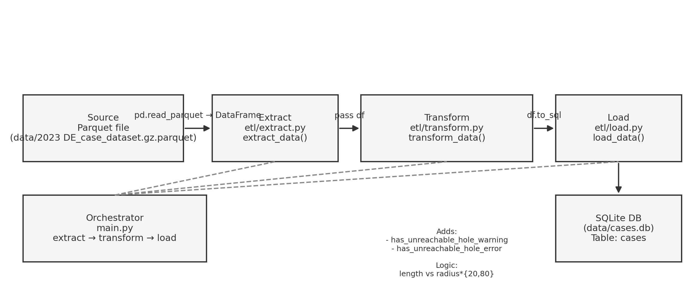
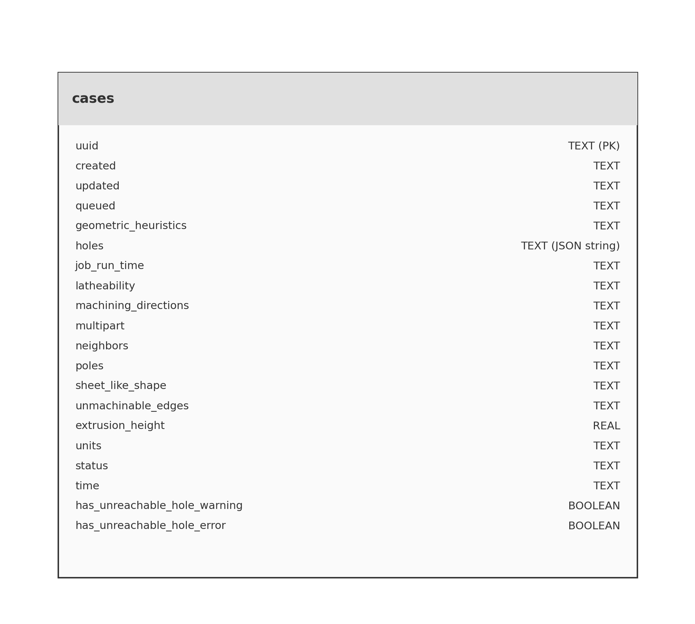

# ETL Project Documentation

This document describes the current ETL pipeline, recommended improvements, and a blueprint for putting it into production.

---

## Current Pipeline Overview

### Architecture
- **Extract**: `etl/extract.py` → loads parquet file into pandas DataFrame.
- **Transform**: `etl/transform.py` → computes two derived flags (`has_unreachable_hole_warning`, `has_unreachable_hole_error`) from `holes` JSON by using specified calculations.
- **Load**: `etl/load.py` → writes DataFrame into SQLite database (`cases` table).
- **Orchestrator**: `main.py` → calls extract → transform → load sequentially.


## How to run it
### 1. Set up a Python environment
Using **venv**:
```bash
python3 -m venv cases-env
source cases-env/bin/activate   # Linux/macOS
.\cases-env\Scripts\activate    # Windows PowerShell
```

### 2. Install Dependencies
```bash
pip install -r requirements.txt
```

### 3. Put the Data into data Folder
Please download and put data into `data` folder:
```bash
mv "2023 DE_case_dataset.gz.parquet" protolabs-challenge/data
```

### 4. Run the pipeline
```bash
python main.py
```

### 4. Check the data in query.ipynb notebook
Choose the kernel of the notebook as the Python virtual environment you created! You can execute cells in `query.ipynb` notebook to examine data!


## Schemas
### Initial Schema (18 columns)
- Raw parquet data with string, float, and object types.

### Final Schema (20 columns)
- Adds 2 boolean columns:
  - `has_unreachable_hole_warning`
  - `has_unreachable_hole_error`

### Diagrams
- **ETL Architecture**:


- **ERD**:  


---

## Improvements for Development Quality

1. **Explicit transforms & type parsing**
   - Parse datetime fields properly.
   - Replace NA checks with `pd.isna`/`pd.notna`.
   - Unit tests for JSON edge cases.

2. **Data validation / quality gates**
   - Use [Great Expectations](https://greatexpectations.io/) or `pandera` to validate schema and data ranges.

3. **incrementals**
   - Support incremental loads using `updated` watermark.

4. **Logging & observability**
   - Add structured logging with record counts, duration, and anomalies.

5. **Configuration**
   - Externalize constants to YAML or environment variables.

6. **Schema management**
   - Consider normalizing `holes` into its own table.

---

## Production Blueprint

### 1. Target Platform & Storage
- Object store (S3, GCS) for raw data.
- Postgres or data warehouse for analytics (instead of SQLite).

### 2. Orchestration & Scheduling
- Prefect or Airflow DAG:
  - Tasks: extract → transform → validate → load.
  - Schedule: hourly/daily with retries.

### 3. Containerization
Example Dockerfile:

```dockerfile
FROM python:3.11-slim
WORKDIR /app

# Install uv
RUN pip install uv

# Copy project metadata and install dependencies
COPY pyproject.toml uv.lock* ./
RUN uv pip install --system --no-cache --no-deps -r uv.lock

# Copy code
COPY etl/ etl/
COPY main.py .
ENV ETL_CONFIG=/app/config/prod.yaml

CMD ["python", "main.py"]

```

### 4. Configuration & Secrets
- YAML config for paths, thresholds, and batch sizes.
- Secrets in AWS Secrets Manager or Vault.

### 5. Deployment
- Deployment can be automatized by using Terraform.

### 6. Monitoring & Alerts
- Counters: rows_in, rows_out, warnings, errors.
- Alerts if anomalies detected.

### 7. Metadata & Lineage
- Run log table with run_id, counts, checksums.
- Optional OpenLineage/Marquez integration.


## Answers to Questions about the Assessment
### 1. How long did it take you to complete the task?
It took a few hours.

### 2. What part did you find the most challenging? Was something unclear?
Processing holes data was a bit challenging. Everything was clear to me!

### 3. Do you think the assignment has an appropriate level of difficulty?
I think it is good for quickly assessing fundamental knowledge.

### 4. Does the assignment evaluate what you expected?
Yes, I found it as a good assignment for evaluation.
---
